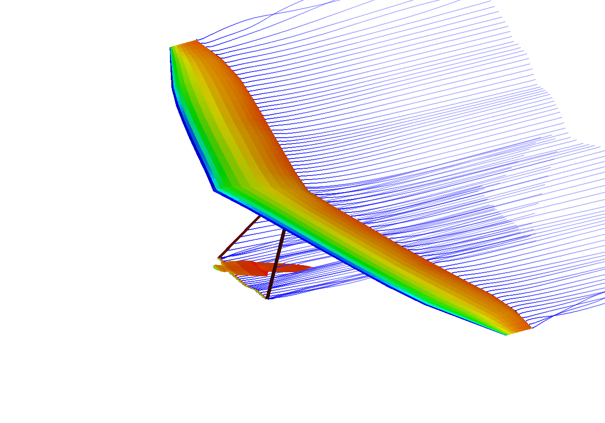

**Model Name:** Avian Evo3

**Description:** Full aircraft model

**Model Fidelity:** Definitive

**Author:** Tim Swait (Avian Hang Gliders)
**Email:** avian'at'hanggliding.co.uk

---
# Avian Evo3
## Aircraft type
The Evo3 is a high performance flexwing (FAI Class 1 Open) racing hang glider of 'topless' design (no kingpost). This glider has a large VG (variable geometry range), pulling VG tight pulls the sail tighter and so reducing the washout.

## Model source
This model is collated from a number of sources. Firstly a laser scan was made of the glider suspended inverted from the hang point with the VG full tight. The effect of gravity acting on the sail therefore was in the same direction as lift would act on it in flight, albeit of a lower magnitude and different distribution. Sail patterns and CAD of the frame geometry were used to tidy up the laser scan information into a definitive 3D CAD, which was used to create the sweep, twist and chord lengths. Sections were taken direct from the laser scan, cleaned up, splines fitted and turned into .dat files. This forms the 'VG Tight' wing shape in the model. Note: this represents a minimum level of washout of the essentially unloaded wing, in flight the washout will be higher due to loads.

For the VG loose wing shape also given in the model, LiDAR data obtained in flight flying with a slack VG setting was used along with in flight camera footage from the keel to record the curve of the trailing edge. This was then used to generate a twist distribution representing the loaded, in flight, shape with the VG slack. In reality, the sweep and curve of the leading edge will also change between the two VG settings, but this is not currently accounted for, only the twist is changed.

## Analysis
The partially single surface nature of the aerofoil is modelled by placing the upper and lower surfaces very close to each other. This means that Panel mode analysis cannot be applied, only VLM. The values of L/D and CL obtained from VLM analysis are broadly reasonable considering the wing only. The knockdown in performance for the VG slack case compared to the VG tight is also reasonable.

The control frame and pilot are also modelled, although wires and keel are not. The control frame and pilot do not add a realistic level of drag when included in VSPAERO however, presumably because separation is not captured by the VLM method.

### Copyright
Copyright (c) 2024 Dr Timothy Swait, Avian Ltd

Permission is hereby granted, free of charge, to any person obtaining a copy
of this software and associated documentation files (the "Software"), to deal
in the Software without restriction, including without limitation the rights
to use, copy, modify, merge, publish, distribute, sublicense, and/or sell
copies of the Software, and to permit persons to whom the Software is
furnished to do so, subject to the following conditions:

The above copyright notice and this permission notice shall be included in all
copies or substantial portions of the Software.

THE SOFTWARE IS PROVIDED "AS IS", WITHOUT WARRANTY OF ANY KIND, EXPRESS OR
IMPLIED, INCLUDING BUT NOT LIMITED TO THE WARRANTIES OF MERCHANTABILITY,
FITNESS FOR A PARTICULAR PURPOSE AND NONINFRINGEMENT. IN NO EVENT SHALL THE
AUTHORS OR COPYRIGHT HOLDERS BE LIABLE FOR ANY CLAIM, DAMAGES OR OTHER
LIABILITY, WHETHER IN AN ACTION OF CONTRACT, TORT OR OTHERWISE, ARISING FROM,
OUT OF OR IN CONNECTION WITH THE SOFTWARE OR THE USE OR OTHER DEALINGS IN THE
SOFTWARE.
