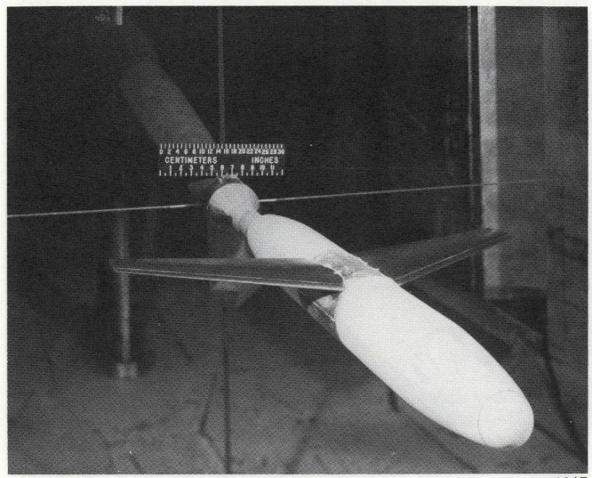

**Model Name:** NASA Roll Damping Model
**Description:** A wing + fuselage model used in wind tunnel testing to measure roll damping effectiveness of different wings.
**Model Fidelity:** 1
**Author (optional):** Daniel Enriquez
**Email (optional):**

---

# NASA Roll Damping Model

## Aircraft type

## Model Source

[SUBSONIC ROLL-DAMPING CHARACTERISTICS
OF A SERIES OF WINGS](https://ntrs.nasa.gov/api/citations/19750004866/downloads/19750004866.pdf)

### Copyright

Copyright (c) 2024 [fullname]
